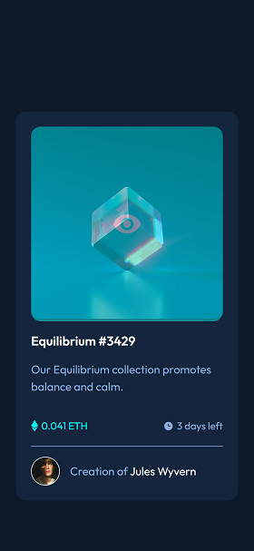

# Frontend Mentor - NFT preview card component solution

This is a solution to the [NFT preview card component challenge on Frontend Mentor](https://www.frontendmentor.io/challenges/nft-preview-card-component-SbdUL_w0U). Frontend Mentor challenges help you improve your coding skills by building realistic projects. 

## Table of contents

- [Overview](#overview)
  - [The challenge](#the-challenge)
  - [Screenshot](#screenshot)
  - [Links](#links)
- [My process](#my-process)
  - [Built with](#built-with)
  - [What I learned](#what-i-learned)
  - [Continued development](#continued-development)
  - [Useful resources](#useful-resources)
- [Author](#author)
- [Acknowledgments](#acknowledgments)

## Overview

### The challenge

Users should be able to:

- View the optimal layout depending on their device's screen size
- See hover states for interactive elements

### Screenshots

### Links
- Solution URL: [Add solution URL here](https://your-solution-url.com)
- Live Site URL: [Add live site URL here](https://your-live-site-url.com)

## My process

### Built with

- Semantic HTML5 markup
- CSS custom properties
- Flexbox
- CSS Grid

### What I learned

Though this exercise seems simple, I learnt some important things while creating the solution
1. How to overlay an icon over an image
2. How to align small icons and text next to it.
3. Learn how to use flexbox for layout of items in a row and spacing where required.

### Continued development

I want to learn responsive techniques without using many media queries.
I want to learn how to center things on the screen in a modern way.
I also want to learn the correct way of overlays.

### Useful resources

- [W3schools](https://www.w3schools.com/howto/howto_css_image_overlay_icon.asp) - This helped me with icon overlay over image.
- [MDN](https://developer.mozilla.org/en-US/docs/Learn/CSS/Howto/Center_an_item) - How to center an element at the center using flexbox
- [MDN](https://developer.mozilla.org/en-US/docs/Web/CSS/CSS_Flexible_Box_Layout/Aligning_Items_in_a_Flex_Container#using_auto_margins_for_main_axis_alignment) - How to align items in a row with separations at desired locations.

## Author

- Frontend Mentor - [@BikeInMan](https://www.frontendmentor.io/profile/BikeInMan)

## Acknowledgments
All thanks to frontend mentor for providing such a neat excercise.

